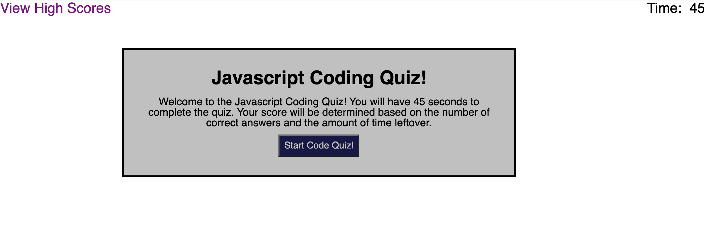

# JS-Code-Quiz

## Description

I was tasked with creating a javascript coding quiz. The quiz is five questions long and the player has thirty seconds to complete the quiz. The player's score is a product of the number of correct and the time leftover on the clock.

## Usage

The user is first introduced to the quiz with a description of the quiz and the scoring. There is a start quiz button, which starts the timer and changes the screen to the first question. When the quiz is over the score is produced with a form to fill out the user's name to post with the score to the high scores page.

## Credits

- Tutor: Aaron Centeno
- VSCode
- MDN Web Docs
- W3Schools
- Stack Overflow

## Links

URL for the deployed website: https://gallaghj13.github.io/JS-Code-Quiz/ \
Github repository: https://github.com/gallaghj13/JS-Code-Quiz

